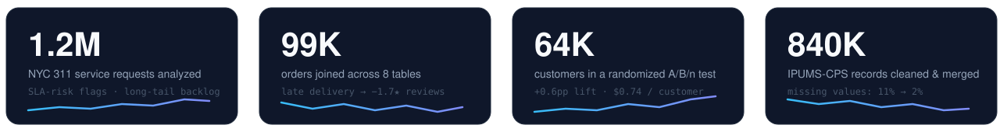
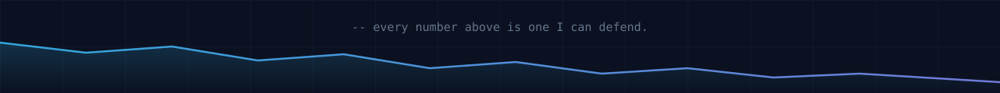

<div align="center">






<a href="https://www.linkedin.com/in/zen-ash"></a>
<a href="https://public.tableau.com/app/profile/aayush.kumar3621"></a>

</div>

## 🧾 About me — as a query

```sql
SELECT *
FROM   analysts
WHERE  username = 'zen-ash';
-- pro tip: always look at what's ACTUALLY stored inside a "date" column
```

| field | value |
|---|---|
| 🎓 `education` | B.S. Computer Science @ **Georgia State University** — GPA **3.9**, Atlanta, GA |
| 🔬 `current_role` | **Undergraduate Research Assistant** — econometrics on **840K** IPUMS-CPS records (Python, Stata, SQL): diff-in-diff & fixed-effects models, plus a refresh pipeline that turned a 5-hour manual update into a 10-minute run |
| 🏢 `experience` | **2 years as a Housing Operations Data Analyst** — cleaning, auditing, and dashboarding real operational data with Python, SQL, and Tableau |
| 🧪 `focus` | Experimentation · operations analytics · KPI reporting · data validation |
| 🎯 `seeking` | **Data Analyst / BI / Product & Operations Analytics internships** |

<div align="right"><sub><code>→ 1 row returned (0.04 s)</code></sub></div>

## 📊 Featured analytics work

| Project | The short version | Stack |
|---|---|---|
| 🛒 **[E-Commerce Customer Experience & Operations Analysis](https://github.com/zen-ash/olist-ecommerce-analysis)** <br/> [▶ Live Tableau dashboard](https://public.tableau.com/app/profile/aayush.kumar3621/viz/OlistE-CommerceCustomerExperienceOperationsAnalysis/1ExecutiveOverview) | Joined 8 relational tables covering **99K orders**. Late deliveries averaged **1.7 fewer stars** and drove **38% of all 1-star reviews**; orders delayed 5+ days had a **43%** 1–2-star rate. Kruskal–Wallis & chi-square testing isolated 12 sellers behind 14% of late shipments. 5-dashboard executive workbook. | `SQL` `Python` `DuckDB` `Tableau` |
| 🧪 **Marketing Experimentation & Incremental Revenue** | Randomized 3-arm email experiment across **64K customers**: verified pre-campaign balance, estimated a **+0.6pp conversion lift** and **$0.74 incremental revenue per customer** with proportion tests + bootstrap CIs. Holm-adjusted segment analysis → simulated targeting captured **82% of revenue at 46% of send volume**. | `Python` `SciPy` `SQL` `A/B/n` |
| 🏙️ **NYC 311 Service Operations & Process Analysis** | **1.2M service requests**: median resolution met agency benchmarks while 90th-percentile times ran **2.8×** over — a long-tail backlog masked by standard reporting. Flagged 8.4% reopened/duplicate submissions and built SLA-risk flags covering 14% of open requests. | `SQL` `Python` `Tableau` |
| 🥽 **[XR Session Telemetry](https://github.com/zen-ash/xr-session-telemetry)** | Behavioral telemetry pipeline for XR training sessions — S3 → Postgres → dbt ingest, LLM scoring, and an eval harness measuring agreement against human labels. | `Python` `Postgres` `dbt` `AWS` |

<div align="center">

🔗 More on my [portfolio site](https://zen-ash.github.io) &nbsp;•&nbsp; 📈 Dashboards on [Tableau Public](https://public.tableau.com/app/profile/aayush.kumar3621)

</div>

## 🧰 Toolkit

<div align="center">

**Querying & Analysis**

      

**BI & Visualization**

      

**Data Platforms & Tools**

      

**Methods** &nbsp;·&nbsp; A/B testing · hypothesis testing · regression · cohort & funnel analysis · forecasting · data validation · KPI reporting

</div>

## 🚢 Also shipping

- 📱 **[On Track](https://github.com/zen-ash/on-track)** — an iOS app (Swift) that captures tasks from the Lock Screen or Siri before you forget them: natural-language dates, priorities, recurrence — parsed on-device
- 🌐 **[zen-ash.github.io](https://github.com/zen-ash/zen-ash.github.io)** — my portfolio site

## 🤝 Let's connect

<div align="center">

<a href="https://www.linkedin.com/in/zen-ash"></a>
<a href="mailto:kaayush2804@gmail.com"></a>
<a href="https://public.tableau.com/app/profile/aayush.kumar3621"></a>
<a href="https://zen-ash.github.io"></a>

<br/><br/>



</div>
